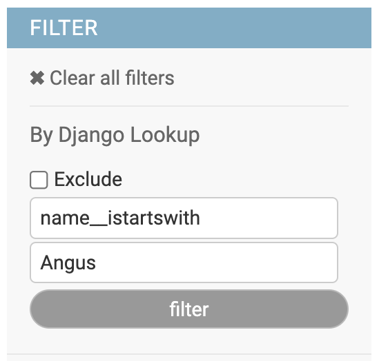

.. include:: ../globals.rst

.. _filters_dj:

DjangoLookupFilter
==================

This filter allow you to use any lookups allowed in Django queries, can work on direct fields as well as on foreign keys.

Usage
-----

python::

    class MyModelAdmin(models.ModelAdmin):
        list_filter = (
            DjangoLookupFilter,
            ...
            )

Options
~~~~~~~

.. attribute:: DjangoLookupFilter.can_negate

    Control ability to work as `exclude` filter. Set to `False` hides the Exclude checkbox

.. attribute:: DjangoLookupFilter.placeholder

    Placeholder value for the Key input text. (Default. "field value")

.. attribute:: DjangoLookupFilter.field_placeholder

    Placeholder value for Value input text. (Default. "field lookup. Es. name__startswith")

.. attribute:: DjangoLookupFilter.template

    Template name used to render the filter. (Default. "adminfilters/dj.html")

.. attribute:: DjangoLookupFilter.title

    Filter title. (Default. "Django Lookup")

Configuration
~~~~~~~~~~~~~

The filter can be configured either using subclassing or `.factory()` method::

    class MyModelAdmin(models.ModelAdmin):
        list_filter = (
            DjangoLookupFilter.factory(title=_("Generic field filter")),
            ...
            )
