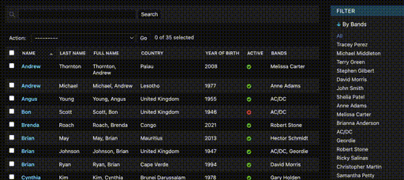

.. include:: ../globals.rst

.. _filters_multiselect:

===========================
IntersectionFieldListFilter
===========================

A FieldListFilter which allows multiple selection of filters for many-to-many type fields. A list of objects will be returned whose m2m contains all the selected filters.

.. image:: ../images/intersection.gif
    :width: 900

Usage
-----

python::

    class DemoModelAdmin_UnionFieldListFilter(DebugMixin, ModelAdmin):
        list_filter = (("bands", IntersectionFieldListFilter),)

====================
UnionFieldListFilter
====================

A FieldListFilter which allows multiple selection of filters for many-to-many type fields, or any type with choices. A list of objects will be returned whose m2m or value set contains one of the selected filters.

Usage
-----

python::

    class DemoModelAdmin_UnionFieldListFilter(DebugMixin, ModelAdmin):
        list_filter = (("bands", UnionFieldListFilter),)
