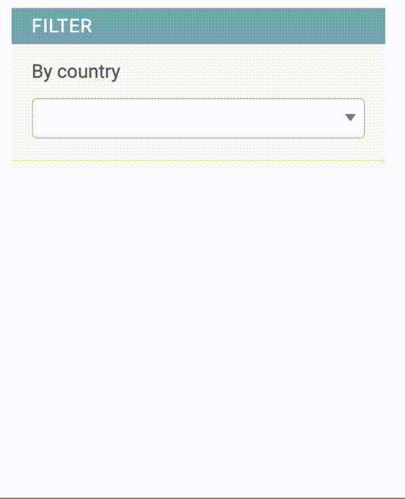

# Autocomplete Filters

## AutoComplete

{width=200}

This filter is for ForeignKeys and uses select2_ javascript. It is based on the standard Django
[autocomplete](https://docs.djangoproject.com/en/4.0/ref/contrib/admin/#django.contrib.admin.ModelAdmin.autocomplete_fields) implementation, no external libraries are needed.

See Django autocomplete_ documentation for the ajax service options.

### Usage

    class MyCountry(models.ModelAdmin):
        search_fields = ('name', )

    class MyModelAdmin(AdminFiltersMixin, models.ModelAdmin):
        list_filter = (
            ('country', AutoCompleteFilter),
            ...
            )

#### Extend AutocompleteFilter

It is possible to customise AutoComplete filter to be used with custom urls. 
Using django-admin-extra-buttons it is quite straightforward

    @admin.register(MyModel)
    class MyModelAdmin(ExtraButtonsMixin, models.ModelAdmin)

        @view()
        def staff_only_autocomplete(self, request):
            filters = {"is_staff": True}
            if term := request.GET.get("term"):
                filters["username__icontains"] = term
            results = []
            for user in User.objects.filter(**filters).distinct():
                results.append({"id": user.id, "text": user.username})
            res = {"results": results, "pagination": {"more": False}}
            return JsonResponse(res)
 
    
    class UserAutoCompleteFilter(AutoCompleteFilter):
        ajax_url = "admin:app_mymodel_autocomplete"

        def queryset(self, request, queryset):
            try:
                q_object = build_q_object_from_lookup_parameters(self.used_parameters)
                return queryset.filter(q_object)
            except (ValueError, ValidationError) as e:
                # Fields may raise a ValueError or ValidationError when converting
                # the parameters to the correct type.
                raise IncorrectLookupParameters(e)

## LinkedAutoComplete

{width=200,align=center}

As filter_autocomplete_ it can be used in case dependant master/details elements where we want to limits the "details" based on the "master" selection.

### Usage

    class Country(models.Model):
        ...

    class Region(models.Model):
        country = models.ForeignKey(Country, ...)

    class MyModel(models.Model):
        region = models.ForeignKey(Region, ...)

    class MyCountry(AdminAutoCompleteSearchMixin, models.ModelAdmin):
        search_fields = ('name', )

    class MyRegion(AdminAutoCompleteSearchMixin, models.ModelAdmin):
        search_fields = ('name', )

    class MyModelAdmin(AdminFiltersMixin, models.ModelAdmin):
        list_filter = (
            ('region__country', LinkedAutoCompleteFilter.factory(parent=None)),
            ('region', LinkedAutoCompleteFilter.factory(parent="region__country")),
            ...
            )
