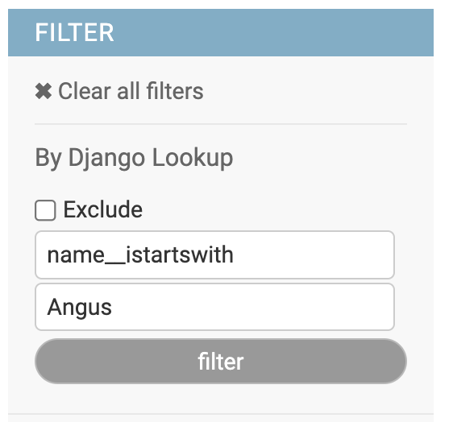

# Django Filters

## DjangoLookupFilter

{width=200}

This filter allow you to use any lookups allowed in Django queries, can work on direct fields as well as on foreign keys.

## Usage

    class MyModelAdmin(AdminFiltersMixin, models.ModelAdmin):
        list_filter = (
            DjangoLookupFilter,
            ...
            )

## Options

- DjangoLookupFilter.can_negate
    
    Control ability to work as `exclude` filter. Set to `False` hides the Exclude checkbox

- DjangoLookupFilter.placeholder

    Placeholder value for the Key input text. (Default. "field value")

- DjangoLookupFilter.field_placeholder

    Placeholder value for Value input text. (Default. "field lookup. Es. name__startswith")

- DjangoLookupFilter.template

    Template name used to render the filter. (Default. "adminfilters/dj.html")

- DjangoLookupFilter.title

    Filter title. (Default. "Django Lookup")

## Configuration

The filter can be configured either using subclassing or `.factory()` method:

    class MyModelAdmin(models.ModelAdmin):
        list_filter = (
            DjangoLookupFilter.factory(title=_("Generic field filter")),
            ...
            )
