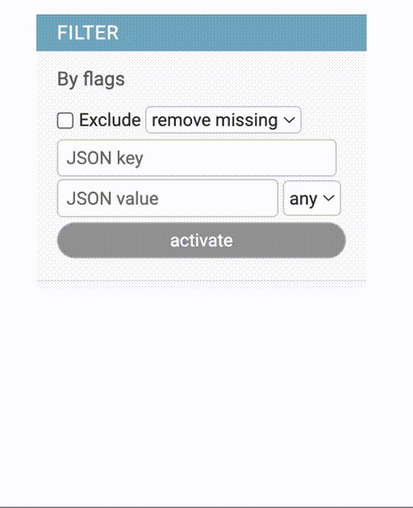

# JsonField Filter

{width=200}

Specialized filter for [JSONField](https://docs.djangoproject.com/it/4.0/ref/models/fields/#django.db.models.JSONField). 
I allows to filter nested json structure and handle different data types.

## Usage

python::

    class MyModel(models.ModelAdmin):
        flags = models.JSONField()

    class MyModelAdmin(AdminFiltersMixin, models.ModelAdmin):
        list_filter = (
            ('flags', JsonFieldFilter),
            ...
            )

### Options

- JsonFilter.can_negate

    Control ability to work as `exclude` filter. Set to `False` hides the Exclude checkbox

- JsonFilter.options

    It enable/disable option policy selection. Defines how the filter should treat records with missing key records.

    - `remove missing`: filter out any record that do not contains the selected key

    - `add missing`: includes records that do not have the selected key

- JsonFilter.placeholder

    Placeholder value for the Key input text. (Default. "JSON key")

- JsonFilter.key_placeholder

    Placeholder value for Value input text. (Default. "JSON value")

- JsonFilter.template

    Template name used to render the filter. (Default. "adminfilters/json.html")

- JsonFilter.title

    Filter title. (Default. "<Field verbose_name>")

###Configuration

The filter can be configured either using subclassing or `.factory()` method::

    class MyModelAdmin(models.ModelAdmin):
        list_filter = (
            ('flags', JsonFieldFilter.factory(can_negate=False, options=True,
                                              title=_("FLAGS"))),
            ...
            )
