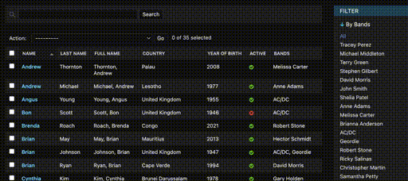
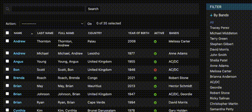

# Many To Many

## IntersectionFieldListFilter

{width=400}

A FieldListFilter which allows multiple selection of filters for many-to-many type fields. A list of objects will be
returned whose m2m contains all the selected filters.

### Usage

    class DemoModelAdmin_UnionFieldListFilter(DebugMixin, ModelAdmin):
        list_filter = (("bands", IntersectionFieldListFilter),)

## UnionFieldListFilter

{width=400}

A FieldListFilter which allows multiple selection of filters for many-to-many type fields, or any type with choices. A
list of objects will be returned whose m2m or value set contains one of the selected filters.

### Usage

    class DemoModelAdmin_UnionFieldListFilter(DebugMixin, ModelAdmin):
        list_filter = (("bands", UnionFieldListFilter),)
