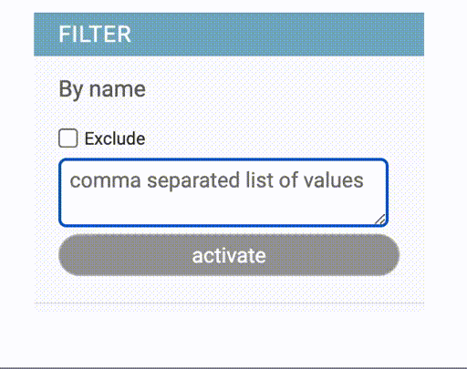

# Multiple Choices

MultiValueFilter
================

{width=400}

Targets can be typed as comma separated list of values.

## Usage

    class MyModelAdmin(models.ModelAdmin):
        list_filter = (
            ('country__name', MultiValueFilter),
            ...
            )

## Options

- MultiValueFilter.can_negate

    Control ability to work as `exclude` filter. Set to `False` hides the Exclude checkbox

- MultiValueFilter.placeholder

    Placeholder value for the Key input text. (Default. "JSON key")

- MultiValueFilter.template

    Template name used to render the filter. (Default. "adminfilters/value.html")

- MultiValueFilter.title

    Filter title. (Default. "<Field verbose_name>")

## Configuration

The filter can be configured either using subclassing or ``.factory()`` method::

    class MyModelAdmin(models.ModelAdmin):
        list_filter = (
            ('name', MultiValueFilter.factory(can_negate=False, options=True,
                                              title=_("Person full name"))),
            ...
            )
