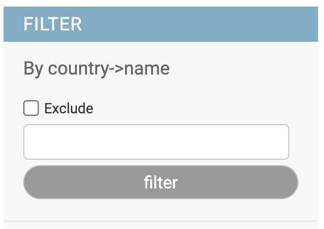

# Exact Match

## ValueFilter

{width=300}

Filter that allow you to type the desired value, can works either with direct fields as withn foreign keys.
By default it uses `exact` lookup

### Usage

    class MyModelAdmin(AdminFiltersMixin, models.ModelAdmin):
        list_filter = (
            ('name', ValueFilter),
            ('country__name', ValueFilter),  # to foreign key
            ('full_name', ValueFilter.factory(lookup='istartswith'),  #  custom lookup
            ...
            )

### Options

- ValueFilter.can_negate

    Control ability to work as `exclude` filter. Set to `False` hides the Exclude checkbox

- ValueFilter.placeholder

    Placeholder value for the Key input text. (Default. "JSON key")

- ValueFilter.template

    Template name used to render the filter. (Default. "adminfilters/value.html")

- ValueFilter.title

    Filter title. (Default. "<Field verbose_name>")

### Configuration

The filter can be configured either using subclassing or `.factory()` method::

    class MyModelAdmin(AdminFiltersMixin, models.ModelAdmin):
        list_filter = (
            ('name', ValueFilter.factory(can_negate=False, options=True,
                                              title=_("Person full name"))),
            ...
            )
